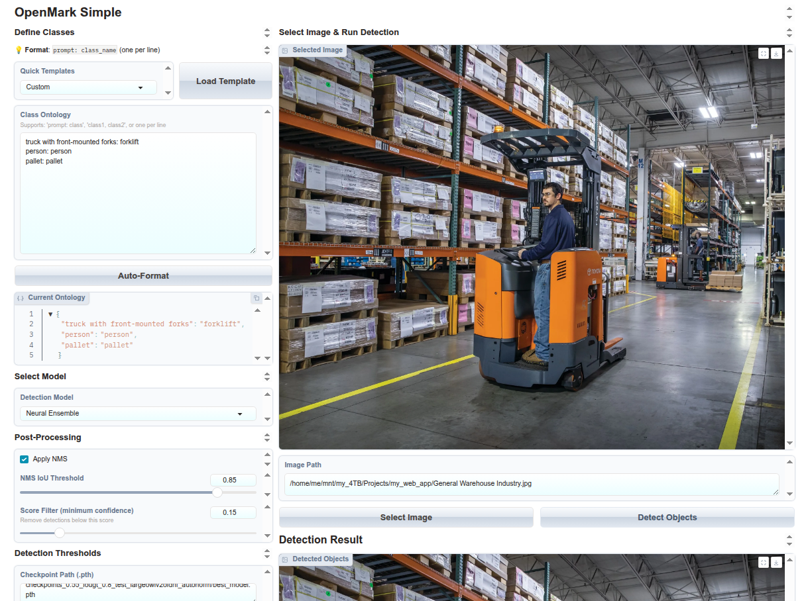
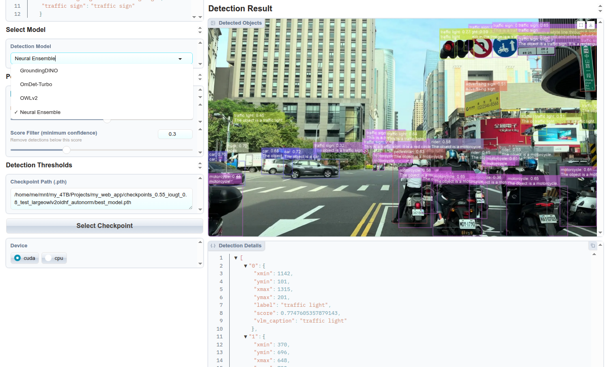
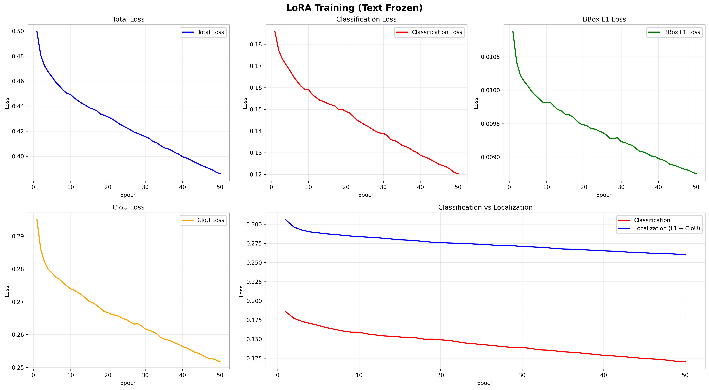
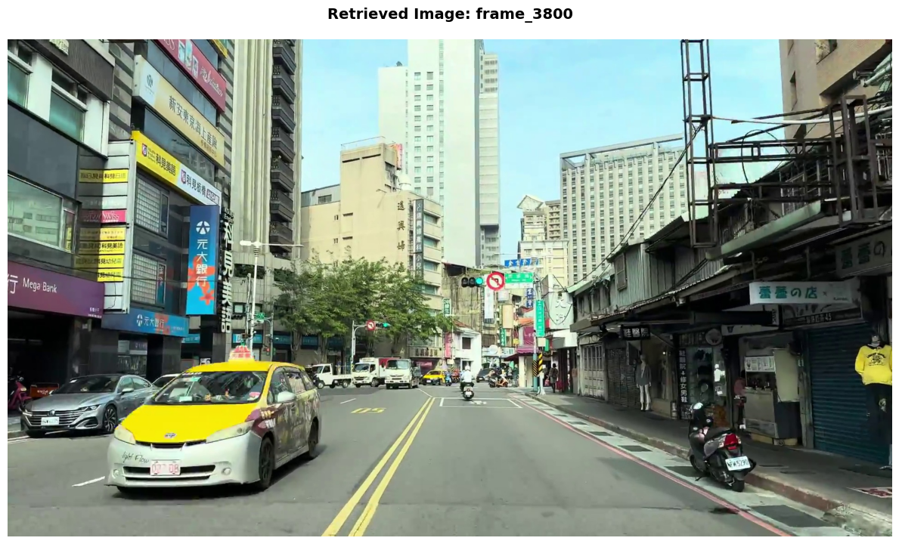

# Materials - Autonomous Driving Perception Research

Research portfolio and supplementary materials for open-vocabulary object detection, VLM-based auto-labeling, and parameter-efficient model adaptation for autonomous driving perception systems.

---

## 🚀 Deployment: Distilled YOLOv8 Real-Time Inference

A lightweight **YOLOv8-Nano** model was trained **entirely** on high-quality annotations generated by our heavy VLM-based Data Engine. This demonstrates our ability to distill complex zero-shot vision-language models into fast, production-ready, edge-deployable detectors.

[](https://www.youtube.com/watch?v=Om5kYzBqwuw)

[https://www.youtube.com/watch?v=Om5kYzBqwuw](https://www.youtube.com/watch?v=Om5kYzBqwuw)

*(Click on the image or YouTube link to watch the real-time inference demonstration)*

### Hardware Benchmarking & Edge Projections
Currently running via the Ultralytics Python runtime.
| Environment | Framework / Precision | Hardware | Avg. Inference Time | Avg. FPS |
| :--- | :--- | :--- | :--- | :--- |
| **Local Baseline** | PyTorch (.pt,auto) | RTX 3090 | 4.9 ms | **205.6 FPS** |
| **Edge Target** | TensorRT (FP16) | Jetson Orin Nano 8GB | ~22-26ms | **~38 - 45 FPS** |

Video credit:
[https://www.youtube.com/watch?v=P8Uh9f0EaU8](https://www.youtube.com/watch?v=EXFlYUM5FgI)

---


## 📁 Data Engine

System architecture of the auto-labeling data engine.

- [README](Data_engine/README.md)
- [System Overview (PDF)](Data_engine/System_overview.pdf)

[](Data_engine/System_overview.png)

---

## 📁 UI - Auto-Labeling Interface

Gradio-based interface for open-vocabulary object detection and object captioning.

- [README](UI/README.md)

[](UI/Ontology-and-templates.png)

[](UI/Results.png)

---

## 📁 Object Captioning - Qwen2-VL

VLM-based semantic captioning with Qwen2-VL-7B on BDD100K scenes.

- [README](Object_captioning_Qwen2VL/README.md)

[](Object_captioning_Qwen2VL/BDD100K_val_c924c4a4-bd2df2dc.png)

[](Object_captioning_Qwen2VL/BDD100K_val_c415a08c-50060410.png)

[](Object_captioning_Qwen2VL/BDD100K_val_b533db8e-7e5a6abb.png)

[](Object_captioning_Qwen2VL/BDD100K_val_b4c86653-d9ba99f4.png)

---

## 📁 SAM3 - Zero-Shot Segmentation

Bounding box proposals from open-vocabulary detectors refined into pixel-level instance masks using SAM3.

- [README](SAM3/README.md)

[](SAM3/BDD100K_val_c415a08c-50060410.png)

[](SAM3/BDD100K_val_c415a08c-50060410_SAM3.png)

---

## 📁 LoRA Vision Adaptation

Parameter-efficient fine-tuning of OWLv2, OmDet-Turbo, and GroundingDINO on BDD100K.

| Model | Baseline | After LoRA | Δ |
|-------|----------|------------|---|
| OWLv2-base-patch16 | 20.63% | **27.81%** | +7.18% |
| OmDet-Turbo-Swin | 17.14% | **21.64%** | +4.50% |
| GroundingDINO-tiny | 20.89% | **23.60%** | +2.71% |

*mAP@[0.50:0.95], evaluated on BDD100K validation set.*

- [README](LoRA-vision-adaptation/README.md)

## Training Curves

**OWLv2** ([google/owlv2-base-patch16-ensemble](https://huggingface.co/google/owlv2-base-patch16-ensemble))
[](LoRA-vision-adaptation/OWLv2_LoRA_checkpoints_text_frozen_b16_ciou_training_losses.png)

**OmDet-Turbo** ([omlab/omdet-turbo-swin-tiny-hf](https://huggingface.co/omlab/omdet-turbo-swin-tiny-hf))
[](LoRA-vision-adaptation/Omdet_LoRA_checkpoints_ciou_50epochs.png)

**Grounding DINO** ([IDEA-Research/grounding-dino-tiny](https://huggingface.co/IDEA-Research/grounding-dino-tiny))
[](LoRA-vision-adaptation/GroundingDINO_checkpoints_ciou_textfreeze_50epochs.png)


---
 
## 📁 RAG Tutorial: Multimodal Vehicle Search System
 
A production-ready **Multimodal Retrieval-Augmented Generation (RAG)** system for autonomous driving datasets, combining CLIP image-text embeddings, Qwen2-VL scene captioning, and Qdrant vector search. The system supports natural language queries over large collections of driving footage frames, with no fine-tuning required.
 
### System Architecture
 
| Component | Choice | Rationale |
|-----------|--------|-----------|
| Image Embeddings | CLIP ViT-g-14 (OpenCLIP) | 1024-dim unified image-text space; SOTA zero-shot retrieval |
| Text Embeddings | Nomic-embed-text-v1.5 | 768-dim; optimized for semantic search |
| VLM Captioner | Qwen2-VL-7B-Instruct | Efficient 7B model with strong scene understanding |
| Vector Store | Qdrant | In-memory mode for prototyping, supports persistent storage for production |
 
**Key design principle:** CLIP image and text embeddings share the same 1024-dimensional vector space, enabling direct cross-modal similarity search with no intermediate mapping layer.
 
### Capabilities
 
- **Natural language search**: query driving scenes with text prompts ("yellow taxi", "pedestrians crossing at night")
- **Scene captioning**: auto-generate structured descriptions of each frame via Qwen2-VL-7B
- **Grounded Q&A chatbot**: answer questions about specific traffic situations using retrieved visual context, reducing VLM hallucinations
- **Dual-index retrieval**: fuses image similarity (CLIP) and text similarity (Nomic-embed) for robust ranked results
### Demo
 
**Query**: *"What vehicles are in the image with the yellow taxi?"*
 
[](RAG_tutorial/rag_demo_yellow_taxi.png)
 
**Retrieved scene** (frame_3800): The image depicts a bustling urban street with a yellow taxi, several cars, a motorcycle, and various storefronts and signs.
 
**Answer**: In the image with the yellow taxi, there are several cars and a motorcycle.
 
### Production Scaling Path
 
The current implementation runs Qdrant in-memory mode. To scale to 100K+ frames:
 
```python
# Persistent storage
client = QdrantClient(path="./qdrant_data")
 
# Batched ingestion
for batch in chunked(image_paths, batch_size=1000):
    image_db.add_images(batch, ...)
```
 
### Applications
 
- **Dataset exploration**: "Find all scenes with construction zones"
- **Anomaly detection**: retrieve rare or unusual driving scenarios
- **Annotation assistance**: auto-label images as input to the Data Engine
- **Failure analysis**: query specific edge cases for model debugging
### Links
 
- [Notebook](RAG_tutorial/vehicle_search_VLM_tutorial.ipynb)
- [Requirements](RAG_tutorial/requirements.txt)
---

## 📁 Awards & Certificates

- [README](Awards_and_certificates/README.md)
- 🏆 [Best Paper Award - ICICT 2026 (certificate, scanned PDF)](Awards_and_certificates/ICICT_26_BestPaperAward_r.pdf)
- [Paper - ICICT 2026 (PDF)](Awards_and_certificates/icict2026-48.pdf)
- [KIT Bio Tech & IT Spring School Certificate](Awards_and_certificates/Certificate_KIT_BioTech_IT_Spring_School%20.pdf)
- [KIT Global Human Resource Development Certificate](Awards_and_certificates/KIT_Certificate%20of%20Completion_PHAN%20QUOC%20THANG.pdf)
- [Yanmar Agri R&D Internship Certificate](Awards_and_certificates/Certificate-Yanmar.pdf)
- [IELTS Certificate](Awards_and_certificates/IELTS-Thang0001.pdf)

[](Awards_and_certificates/ICICT_26_bestpaper.jpg)

---

## License

[MIT](LICENSE)
